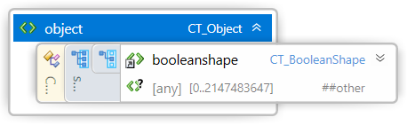
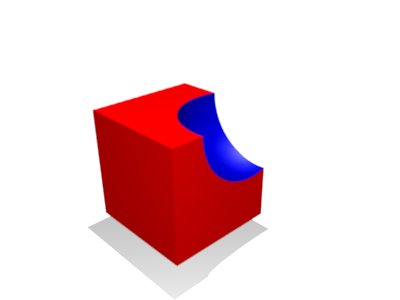

#
# 3MF Boolean Operations Extension

## Specification & Reference Guide


| **Version** | 0.7.6 |
| --- | --- |
| **Status** | Draft |

## Table of Contents

- [Preface](#preface)
  * [About this Specification](#about-this-specification)
  * [Document Conventions](#document-conventions)
  * [Language Notes](#language-notes)
  * [Software Conformance](#software-conformance)
- [Part I: 3MF Documents](#part-i-3mf-documents)
  * [Chapter 1. Overview of Additions](#chapter-1-overview-of-additions)
  * [Chapter 2. Object Resources](#chapter-2-object-resources)
    + [2.1. Boolean Operations](#21-boolean-operations)
- [Part II. Appendices](#part-ii-appendices)
  * [Appendix A. Glossary](#appendix-a-glossary)
  * [Appendix B. 3MF XSD Schema](#appendix-b-3mf-xsd-schema)
  * [Appendix C. Standard Namespace](#appendix-c-standard-namespace)
  * [Appendix D: Example file](#appendix-d-example-file)
- [References](#references)

# Preface

## About this Specification

This 3MF Boolean Operations Extension is an extension to the core 3MF specification. This document cannot stand alone and only applies as an addendum to the core 3MF specification. Usage of this and any other 3MF extensions follow an a la carte model, defined in the core 3MF specification.

Part I, “3MF Documents,” presents the details of the primarily XML-based 3MF Document format. This section describes the XML markup that defines the composition of 3D documents and the appearance of each model within the document.

Part II, “Appendices,” contains additional technical details and schemas too extensive to include in the main body of the text as well as convenient reference information.

The information contained in this specification is subject to change. Every effort has been made to ensure its accuracy at the time of publication.

This extension MUST be used only with Core specification 1.x.

## Document Conventions

See [the 3MF Core Specification conventions](https://github.com/3MFConsortium/spec_core/blob/1.3.0/3MF%20Core%20Specification.md#document-conventions).

In this extension specification, as an example, the prefix "o" maps to the xml-namespace "http://schemas.microsoft.com/3dmanufacturing/booleanoperations/2022/06". See [Appendix C. Standard Namespace](#appendix-c-standard-namespace).

## Language Notes

See [the 3MF Core Specification language notes](https://github.com/3MFConsortium/spec_core/blob/1.3.0/3MF%20Core%20Specification.md#language-notes).

## Software Conformance

See [the 3MF Core Specification software conformance](https://github.com/3MFConsortium/spec_core/blob/1.3.0/3MF%20Core%20Specification.md#software-conformance).

# Part I: 3MF Documents

# Chapter 1. Overview of Additions

The 3MF Core Specification defines the \<components> element in the \<object> resource as definition of a tree of different objects to form an assembly, with the intent to allow the reuse of model definitions for an efficient encoding. The resultant shape of a \<components> element is the aggregation of each \<component> object element.

This extension is based in a simplified Constructive Solid Geometry ([CSG](https://en.wikipedia.org/wiki/Constructive_solid_geometry)) by limiting the scope of the boolean operations described in the following diagram:


The boolean operations are restricted as the boolean operating objects to the base object MUST only reference mesh objects. While the base object to which apply the boolean operations MIGHT BE of any object type.

This document describes a new element \<booleanoperations> in the \<object> elements that specifies a new object type, other than a mesh or components. This element is OPTIONAL for producers but MUST be supported by consumers that specify support for the 3MF Boolean Operations Extension.

To avoid data loss while parsing, a 3MF package which uses referenced objects MUST enlist the 3MF Boolean Operations Extension as “required extension”, as defined in the core specification. However, if the 3MF Boolean Operations Extension is not enlisted a required, any consumer non-supporting the 3MF Boolean Operations Extension may be able to process the rest of the document.

##### Figure 1-1: Overview of 3MF Boolean Operations Extension XML structure


# Chapter 2. Object Resources

Element \<object>



The \<object> element is enhanced with an additional element \<booleanoperations> in the object choice, declaring that the object represents "boolean operations" instead of a mesh or a component, extending [the 3MF Core Specification object resources](https://github.com/3MFConsortium/spec_core/blob/1.2.3/3MF%20Core%20Specification.md#chapter-4-object-resources)

## 2.1. Boolean Operations

Element \<booleanoperations>


| Name   | Type   | Use   | Default   | Annotation |
| --- | --- | --- | --- | --- |
| objectid | **ST\_ResourceID** | required | | It references the object object id to apply the boolean operations |
| operation | **ST\_Operation** | required | | Subtracting boolean operation |
| transform | **ST\_Matrix3D** | | | A matrix transform (see [3.3. 3D Matrices](#33-3d-matrices)) applied to the item to be outputted. |
| path | **ST\_Path** | | | A file path to the object file being referenced. The path is an absolute path from the root of the 3MF container. |
| @anyAttribute | | | | |

The optional \<booleanoperations> element contains one or more \<boolean> elements to perform subtractive boolean operations to the referenced object.

**objectid** - Selects the base object to apply the boolean operations.

**operation** - The subtracting boolean operation to perform. The options for the boolean operations are the following:

1.	*union*. The new object shape is defined as the merger of the shapes. The new object surface property is defined by the property of the surface property defining the outer surface. If material and the volumetric property, if available, in the overlapped volume is defined by the added object, as defined by [the 3MF Core Specification overlapping order](https://github.com/3MFConsortium/spec_core/blob/1.2.3/3MF%20Core%20Specification.md#412-overlapping-order)

    union(base,a,b,c) = base Ս (a Ս b Ս c) = ((base Ս a) Ս b) Ս c

2.  *difference*. The new object shape is defined by the shape in the first object shape that is not in any other object shape. The new object surface property, where overlaps, is defined by the object surface property of the subtracting object(s). While the volume properties are defined by the volume remaining from the base object.

    difference(base,a,b,c) = base - (a Ս b Ս c) = ((base - a) - b) - c

3.  *intersection*. The new object shape is defined as the common (clipping) shape in all objects. The new object surface property is defined as the object surface property of the object defining the new surface. While the volume properties are defined by the volume remaining from the base object.

    intersection(base,a,b,c) = base Ո (a Ս b Ս c) = ((base Ո a) Ո b) Ո c

**transform** - The transform to apply to the selected base object.

**path** - When used in conjunction with [the 3MF Production extension](https://github.com/3MFConsortium/spec_production/blob/master/3MF%20Production%20Extension.md), the "path" attribute references objects in non-root model files. Path is an absolute path to the target model file inside the 3MF container that contains the target object. The use of the path attribute in a \<boolean> element is ONLY valid in the root model file.

The boolean operations are sequentially applied in the order defined by the \<boolean> sequence.

### 2.1.1. Boolean

Element \<boolean>


| Name   | Type   | Use   | Default   | Annotation |
| --- | --- | --- | --- | --- |
| objectid | **ST\_ResourceID** | required | | It references the mesh object id performing the boolean operation. |
| transform | **ST\_Matrix3D** | | | A matrix transform (see [3.3. 3D Matrices](#33-3d-matrices)) applied to the item to be outputted. |
| path | **ST\_Path** | | | A file path to the model file being referenced. The path is an absolute path from the root of the 3MF container. |
| @anyAttribute | | | | |

The \<boolean> element selects a pre-defined object resource to perform a boolean operation to the base object referenced in the enclosing \<booleanoperations> element.

**objectid** - Selects the object with the mesh to apply the boolean operation. The object MUST be a mesh object of type "model" (i.e. not a components or another boolean operations object).

**transform** - The transform to apply to the selected object before the boolean operation.

**path** - When used in conjunction with [the 3MF Production extension](https://github.com/3MFConsortium/spec_production/blob/master/3MF%20Production%20Extension.md), the "path" attribute references objects in non-root model files. Path is an absolute path to the target model file inside the 3MF container that contains the target object. The use of the path attribute in a \<boolean> element is ONLY valid in the root model file.

|  |  |  |
| :---: | :---: | :---: |
| **union**: components of objects | **difference**: subtraction of object from another one | **intersection**: portion common to objects |

The boolean operations follow the fill rule conversion defined by [the 3MF Core Specification fill rule](https://github.com/3MFConsortium/spec_core/blob/1.2.3/3MF%20Core%20Specification.md#411-fill-rule).

# Part II. Appendices

## Appendix A. Glossary

See [the 3MF Core Specification glossary](https://github.com/3MFConsortium/spec_core/blob/1.3.0/3MF%20Core%20Specification.md#appendix-a-glossary).

## Appendix B. 3MF XSD Schema

```xml
<?xml version="1.0" encoding="UTF-8"?>
<xs:schema xmlns="http://schemas.microsoft.com/3dmanufacturing/booleanoperations/2022/06"
  xmlns:xs="http://www.w3.org/2001/XMLSchema"
  targetNamespace="http://schemas.microsoft.com/3dmanufacturing/booleanoperations/2022/06"
  elementFormDefault="unqualified" attributeFormDefault="unqualified" blockDefault="#all">
  <xs:import namespace="http://www.w3.org/XML/1998/namespace"
    schemaLocation="http://www.w3.org/2001/xml.xsd"/>
  <xs:annotation>
    <xs:documentation><![CDATA[   Schema notes: 
 
  Items within this schema follow a simple naming convention of appending a prefix indicating the type of element for references: 
 
  Unprefixed: Element names 
  CT_: Complex types 
  ST_: Simple types 
   
  ]]></xs:documentation>
  </xs:annotation>
  <!-- Complex Types -->
  <xs:complexType name="CT_Object">
    <xs:sequence>
      <xs:choice>
        <xs:element ref="booleanoperations"/>
        <xs:any namespace="##other" processContents="lax" minOccurs="0" maxOccurs="2147483647"/>
      </xs:choice>
    </xs:sequence>
  </xs:complexType>

  <xs:complexType name="CT_BooleanOperations">
    <xs:sequence>
      <xs:element ref="boolean" minOccurs="0" maxOccurs="2147483647"/>
      <xs:any namespace="##other" processContents="lax" minOccurs="0" maxOccurs="2147483647"/>
    </xs:sequence>
    <xs:attribute name="objectid" type="ST_ResourceID" use="required"/>
    <xs:attribute name="operation" type="ST_Operation" use="required"/>
    <xs:attribute name="transform" type="ST_Matrix3D"/>
    <xs:attribute name="path" type="ST_Path"/>
    <xs:anyAttribute namespace="##other" processContents="lax"/>
  </xs:complexType>

  <xs:complexType name="CT_Boolean">
    <xs:attribute name="objectid" type="ST_ResourceID" use="required"/>
    <xs:attribute name="transform" type="ST_Matrix3D"/>
    <xs:attribute name="path" type="ST_Path"/>
    <xs:anyAttribute namespace="##other" processContents="lax"/>
  </xs:complexType>

  <!-- Simple Types -->
  <xs:simpleType name="ST_Operation">
    <xs:restriction base="xs:string">
      <xs:enumeration value="union"/>
      <xs:enumeration value="difference"/>
      <xs:enumeration value="intersection"/>
    </xs:restriction>
  </xs:simpleType>  

  <xs:simpleType name="ST_Matrix3D">
    <xs:restriction base="xs:string">
      <xs:whiteSpace value="collapse"/>
      <xs:pattern value="((\-|\+)?(([0-9]+(\.[0-9]+)?)|(\.[0-9]+))((e|E)(\-|\+)?[0-9]+)?) ((\-|\+)?(([0-9]+(\.[0-9]+)?)|(\.[0-9]+))((e|E)(\-|\+)?[0-9]+)?) ((\-|\+)?(([0-9]+(\.[0-9]+)?)|(\.[0-9]+))((e|E)(\-|\+)?[0-9]+)?) ((\-|\+)?(([0-9]+(\.[0-9]+)?)|(\.[0-9]+))((e|E)(\-|\+)?[0-9]+)?) ((\-|\+)?(([0-9]+(\.[0-9]+)?)|(\.[0-9]+))((e|E)(\-|\+)?[0-9]+)?) ((\-|\+)?(([0-9]+(\.[0-9]+)?)|(\.[0-9]+))((e|E)(\-|\+)?[0-9]+)?) ((\-|\+)?(([0-9]+(\.[0-9]+)?)|(\.[0-9]+))((e|E)(\-|\+)?[0-9]+)?) ((\-|\+)?(([0-9]+(\.[0-9]+)?)|(\.[0-9]+))((e|E)(\-|\+)?[0-9]+)?) ((\-|\+)?(([0-9]+(\.[0-9]+)?)|(\.[0-9]+))((e|E)(\-|\+)?[0-9]+)?) ((\-|\+)?(([0-9]+(\.[0-9]+)?)|(\.[0-9]+))((e|E)(\-|\+)?[0-9]+)?) ((\-|\+)?(([0-9]+(\.[0-9]+)?)|(\.[0-9]+))((e|E)(\-|\+)?[0-9]+)?) ((\-|\+)?(([0-9]+(\.[0-9]+)?)|(\.[0-9]+))((e|E)(\-|\+)?[0-9]+)?)"/>
    </xs:restriction>
  </xs:simpleType>
  
  <xs:simpleType name="ST_ResourceID">
    <xs:restriction base="xs:positiveInteger">
      <xs:maxExclusive value="2147483648"/>
    </xs:restriction>
  </xs:simpleType>
  
  <xs:simpleType name="ST_Path">
    <xs:restriction base="xs:string"> </xs:restriction>
  </xs:simpleType>
  
  <!-- Elements -->
  <xs:element name="object" type="CT_Object"/>
  <xs:element name="booleanoperations" type="CT_BooleanOperations"/>
  <xs:element name="boolean" type="CT_Boolean"/>
</xs:schema>
```

# Appendix C. Standard Namespace

| | |
| --- | --- |
| BooleanOperation | [http://schemas.microsoft.com/3dmanufacturing/booleanoperations/2022/06](http://schemas.microsoft.com/3dmanufacturing/booleanoperations/2022/06) |

# Appendix D: Example file

## 3D model
```xml
<?xml version="1.0" encoding="utf-8" standalone="no"?>
<model xmlns="http://schemas.microsoft.com/3dmanufacturing/core/2015/02"
	xmlns:o="http://schemas.microsoft.com/3dmanufacturing/booleanoperations/2022/06"
	requiredextensions="o" unit="millimeter" xml:lang="en-US">
    <resources>
        <basematerials id="2">
          <base name="Red" displaycolor="#FF0000" />
          <base name="Green" displaycolor="#00FF00" />
          <base name="Blue" displaycolor="#0000FF" />
        <basematerials>
        <object id="3" type="model" name="Cube" pid="2" pindex="0">
            <mesh>
                <vertices>...</vertices>
                <triangles>...</triangles>
            </mesh>
        </object>
        <object id="4" type="model" name="Sphere" pid="2" pindex="2">
            <mesh>
                <vertices>...</vertices>
                <triangles>...</triangles>
           </mesh>
        </object>
        <object id="5" type="model" name="Cylinder" pid="2" pindex="1">
            <mesh>
                <vertices>...</vertices>
                <triangles>...</triangles>
            </mesh>
        </object>
        <object id="6" type="model" name="Intersected">
            <bo:booleanoperations objectid="3" bo:operation="intersection" transform="0.0741111 0 0 0 0.0741111 0 0 0 0.0741111 2.91124 -0.400453 1.60607">
                <bo:boolean objectid="4" transform="0.0741111 0 0 0 0.0741111 0 0 0 0.0741111 2.91124 -0.400453 1.60607"/>
            </bo:booleanoperations>
        </object>
        <object id="10" type="model" name="Full part">
            <bo:booleanoperations objectid="6" bo:operation="difference">
                <bo:boolean objectid="5" transform="0.0271726 0 0 0 0 0.0271726 0 -0.0680034 0 4.15442 3.58836 5.23705" />
                <bo:boolean objectid="5" transform="0.0272014 0 0 0 0.0272012 0 0 0 0.0680035 4.05357 6.33412 3.71548" />
                <bo:boolean objectid="5" transform="0 0 -0.0272013 0 0.0272013 0 0.0680032 0 0 5.05103 6.32914 3.35287" />
            </bo:booleanoperations>
        </object>
    </resources>
    <build>
        <item objectid="10" transform="25.4 0 0 0 25.4 0 0 0 25.4 0 0 0" />
    </build>
</model>
```

# References

**CSG**

From Wikipedia, the free encyclopedia. "Constructive solid geometry". https://en.wikipedia.org/wiki/Constructive_solid_geometry

Cornelia Haslinger, Universität Salzburg. "Constructive Solid Geometry in Education". https://www.uni-salzburg.at/fileadmin/multimedia/Mathematik/images/EMMA/Workshop_Turkey/education_days/CSG_Haslinger_low_quality.pdf.

See the [3MF Core Specification references](https://github.com/3MFConsortium/spec_core/blob/1.3.0/3MF%20Core%20Specification.md#references) for additional references.
