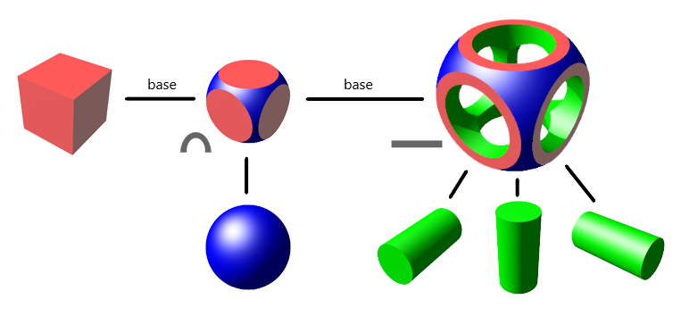

# 3mf-boolean-operations
3MF Boolean Operations extension

This repository contains the Boolean Operations Extension for the 3MF file standard. This extension is based in Constructive solid geometry ([CSG](https://en.wikipedia.org/wiki/Constructive_solid_geometry))

The 3MF Booleans Operations extension simplifies the CSG tree by flattening it as a boolean sequence: 

